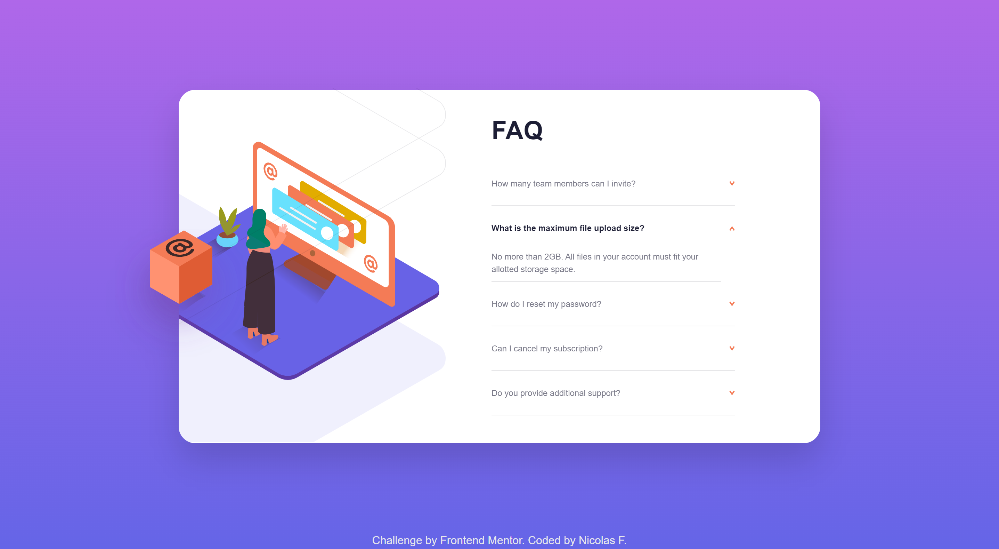

# Frontend Mentor - FAQ accordion card solution

This is a solution to the [FAQ accordion card challenge on Frontend Mentor](https://www.frontendmentor.io/challenges/faq-accordion-card-XlyjD0Oam). Frontend Mentor challenges help you improve your coding skills by building realistic projects.

## Table of contents

- [Overview](#overview)
  - [The challenge](#the-challenge)
  - [Screenshot](#screenshot)
  - [Links](#links)
- [My process](#my-process)
  - [Built with](#built-with)
  - [What I learned](#what-i-learned)
  - [Continued development](#continued-development)
  - [Useful resources](#useful-resources)
- [Author](#author)
- [Acknowledgments](#acknowledgments)

**Note: Delete this note and update the table of contents based on what sections you keep.**

## Overview

### The challenge

Users should be able to:

- View the optimal layout for the component depending on their device's screen size
- See hover states for all interactive elements on the page
- Hide/Show the answer to a question when the question is clicked
- **Bonus**: Complete the challenge without using JavaScript

### Screenshots




### Links

- Solution URL: [Code](https://github.com/nicolasfig/faq-accordion-card)
- Live Site URL: [Live site](https://nicolasfig.github.io/faq-accordion-card)

## My process

### Built with

- Semantic HTML5 markup
- CSS custom properties
- Flexbox
- [Tailwindcss](https://tailwindcss.com/) - Utility-first CSS framework

### What I learned

This was my first time using tailwind I had a hard time but finally got everything working

```html
<section
  class="image-mobile hidden md:block w-[236px] h-[180px] relative top-[-20%] left-[1%]"
>
  
  
</section>
```

### Continued development

I had some trouble with the script while selecting elements from the DOM

### Useful resources

- [Tailwind docs](https://tailwindcss.com/docs/installation) - A must if you're building sites using tailwind

## Author

- Frontend Mentor - [@nicolasfig](https://www.frontendmentor.io/profile/nicolasfig)

## Acknowledgments

- [Dave Gray tailwind course](https://www.youtube.com/watch?v=lCxcTsOHrjo) - This course helped me a lot with the setup steps
